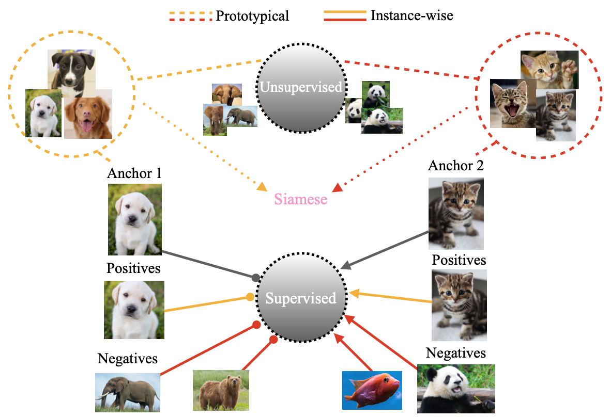

# Siamese Prototypical Contrastive Learning

Official codebase for SPCL. 

SPCL is a new prototypical learning framework that leverages siamese-style metric loss to match intra-prototype features, while increasing the distance between inter-prototype features.

[**Siamese Prototypical Contrastive Learning**](https://arxiv.org/abs/2208.08819)
<br>Shentong Mo, Zhun Sun, and Chao Li}<br>
BMVC 2021.

<div align="center">
  
</div>


## Dependencies

Install dependencies with `requrements.txt`

  `pip install -r requirements.txt`

```
torch
torchvision
tensorboard
tqdm
configargparse
```

## Usage / Run

### Pre-training and Linear Evaluation
Launch the script from `main.py`:

By default the CIFAR-10 dataset is used, use `--dataset` to select from: cifar10, cifar100, imagenet100, imagenet. For ImageNet and TinyImageNet please define a path to the dataset.

**Note**: For Linear Evaluation the ResNet is frozen (all layers), training is only perfomed on the supervised Linear Evaluation layer.

Example:

  `python main.py --model resnet18 --no_distributed --clustering_use --verbose --cluster_weight 1 --reassign 1 --batch_size 512 --dataset cifar10 --pre_classes 10 --gpu_id 0,1 --finetune_learning_rate 0.1 --finetune_optimiser lars`

#### DistributedDataParallel

To train with **Distributed** for a slight computational speedup with multiple GPUs, use:

  `python -m torch.distributed.launch --nnodes=1 --node_rank=0 --nproc_per_node=2 --use_env main.py`


This will train on a single machine (`nnodes=1`), assigning 1 process per GPU where `nproc_per_node=2` refers to training on 2 GPUs. To train on `N` GPUs simply launch `N` processes by setting `nproc_per_node=N`.

The number of CPU threads to use per process is hard coded to `torch.set_num_threads(1)` for safety, and can be changed to `your # cpu threads / nproc_per_node` for better performance. ([fabio-deep](https://github.com/fabio-deep/Distributed-Pytorch-Boilerplate))


#### DataParallel

To train with traditional **nn.DataParallel** with multiple GPUs, use:

  `python main.py --no_distributed`

**Note:** The default config selects to use `--no_distributed`, therefore runnning `python main.py` runs the default hyperparameters without DistributedDataParallel.

### Linear Evaluation of a Pre-Trained Model

To evaluate the performace of a pre-trained model in a linear classification task just include the flag `--finetune` and provide a path to the pretrained model to `--load_checkpoint_dir`.

Example:

  `python main.py --no_distributed --finetune --load_checkpoint_dir ~/SPCL/experiments/yyyy-mm-dd_hh-mm-ss/checkpoint.pt`

### Hyperparameters

The configuration / choice of hyperparameters for the script is handled either by command line arguments or config files.

An example config file is given at `SPCL/config.conf`. Additionally, `.txt` or `.conf` files can be passed if you prefer, this is achieved using the flag `--c <PATH/TO/CONFIG.conf>`.

A list of arguments/options can be found below:

```
usage: main.py [-h] [-c MY_CONFIG] [--dataset DATASET]
               [--dataset_path DATASET_PATH] [--model MODEL]
               [--n_epochs N_EPOCHS] [--finetune_epochs FINETUNE_EPOCHS]
               [--warmup_epochs WARMUP_EPOCHS] [--batch_size BATCH_SIZE]
               [--learning_rate LEARNING_RATE]
               [--finetune_learning_rate FINETUNE_LEARNING_RATE]
               [--weight_decay WEIGHT_DECAY]
               [--finetune_weight_decay FINETUNE_WEIGHT_DECAY]
               [--optimiser OPTIMISER]
               [--finetune_optimiser FINETUNE_OPTIMISER] [--patience PATIENCE]
               [--temperature TEMPERATURE] [--jitter_d JITTER_D]
               [--jitter_p JITTER_P] [--blur_sigma BLUR_SIGMA BLUR_SIGMA]
               [--blur_p BLUR_P] [--grey_p GREY_P] [--no_twocrop]
               [--load_checkpoint_dir LOAD_CHECKPOINT_DIR] [--no_distributed]
               [--finetune] [--supervised] 
               [--contras_weight] [--clustering] [--num_prototypes] 
               [--clustering_use] [--cluster_weight] [--reassign]
               [--cluster_loss] [--metric_loss] [--classifier_init_freq]
               [--metric_learn] [--metric_weight] [--debug]

Pytorch SPCL Args that start with '--' (eg. --dataset) can also be set in a
config file (<PATH>/SPCL/config.conf or specified via -c).
Config file syntax allows: key=value, flag=true, stuff=[a,b,c] (for details,
see syntax at https://goo.gl/R74nmi). If an arg is specified in more than one
place, then commandline values override config file values which override
defaults.

optional arguments:
  -h, --help            show this help message and exit
  -c MY_CONFIG, --my-config MY_CONFIG
                        config file path
  --dataset DATASET     Dataset, (Options: cifar10, cifar100, stl10, imagenet,
                        tinyimagenet).
  --dataset_path DATASET_PATH
                        Path to dataset, Not needed for TorchVision Datasets.
  --model MODEL         Model, (Options: resnet18, resnet34, resnet50,
                        resnet101, resnet152).
  --n_epochs N_EPOCHS   Number of Epochs in Contrastive Training.
  --finetune_epochs FINETUNE_EPOCHS
                        Number of Epochs in Linear Classification Training.
  --warmup_epochs WARMUP_EPOCHS
                        Number of Warmup Epochs During Contrastive Training.
  --batch_size BATCH_SIZE
                        Number of Samples Per Batch.
  --learning_rate LEARNING_RATE
                        Starting Learing Rate for Contrastive Training.
  --finetune_learning_rate FINETUNE_LEARNING_RATE
                        Starting Learing Rate for Linear Classification
                        Training.
  --weight_decay WEIGHT_DECAY
                        Contrastive Learning Weight Decay Regularisation
                        Factor.
  --finetune_weight_decay FINETUNE_WEIGHT_DECAY
                        Linear Classification Training Weight Decay
                        Regularisation Factor.
  --optimiser OPTIMISER
                        Optimiser, (Options: sgd, adam, lars).
  --finetune_optimiser FINETUNE_OPTIMISER
                        Finetune Optimiser, (Options: sgd, adam, lars).
  --patience PATIENCE   Number of Epochs to Wait for Improvement.
  --temperature TEMPERATURE
                        NT_Xent Temperature Factor
  --jitter_d JITTER_D   Distortion Factor for the Random Colour Jitter
                        Augmentation
  --jitter_p JITTER_P   Probability to Apply Random Colour Jitter Augmentation
  --blur_sigma BLUR_SIGMA BLUR_SIGMA
                        Radius to Apply Random Colour Jitter Augmentation
  --blur_p BLUR_P       Probability to Apply Gaussian Blur Augmentation
  --grey_p GREY_P       Probability to Apply Random Grey Scale
  --no_twocrop          Whether or Not to Use Two Crop Augmentation, Used to
                        Create Two Views of the Input for Contrastive
                        Learning. (Default: True)
  --load_checkpoint_dir LOAD_CHECKPOINT_DIR
                        Path to Load Pre-trained Model From.
  --no_distributed      Whether or Not to Use Distributed Training. (Default:
                        True)
  --finetune            Perform Only Linear Classification Training. (Default:
                        False)
  --supervised          Perform Supervised Pre-Training. (Default: False)
  --contras_weight      Contrastive Learning Weight Factor
  --clustering          Clustering algorithm (default: Kmeans)
  --num_prototypes      Number of prototypes used in Kmeans
  --clustering_use      Perform clustering to generate pseudo label or not
  --cluster_weight      Prototypical cross entropy loss weight Factor
  --reassign            How many epochs of training between two consecutive
                        reassignments of clusters
  --cluster_loss        Clustering loss type (default: CE)
  --metric_loss         Siamese metric loss type (default: BCE)
  --classifier_init_freq Frequency epoch of initializing the classifier during pretrain stage
  --metric_learn        Siamese metric learn or not
  --metric_weight       Siamese metric loss weight Factor
  --debug               Debug or not
```


## Citation

If you find this repository useful, please cite our paper:
```
@inproceedings{mo2021spcl,
  title={Siamese Prototypical Contrastive Learning},
  author={Mo, Shentong and Sun, Zhun and Li, Chao},
  booktitle={The British Machine Vision Conference (BMVC)},
  year={2021}
}
```